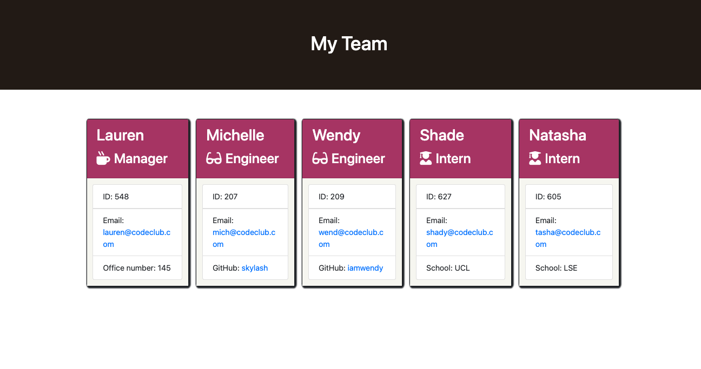

# Team Info Generator

## About the Project
This project is a Node.js command-line application developed to enable a user (in this instance the team manager) input information about employees on their team thereby generating an HTML webpage that displays the summary for each member of the team. The application has test files that ensures that every part of the code passes each test.


## Installation
In order to be able to use this application, the user has to install 
* [Inquirer](https://www.npmjs.com/package/inquirer) for collecting user inputs
* [Jest](https://www.npmjs.com/package/jest) for running the unit tests

* The application will be started using the following command:

```bash
node index.js
```


## Usage
The application runs in the command line and enables the user to generate a webpage displaying basic information about team members with quick access to emails and github profiles. 
When the application is started, the user is prompted to enter the team manager's name, employee ID, email address and office number. Once these has been provided, the user is then presented with a menu with options to add specific team member (an engineer, an intern, or an option to finish building the team).
When the user selects the engineer option, the user is prompted to enter their name, ID, email and Github username. Once this is done the user is taken back to the menu option to add more team member or finish building the team. If a user selects the intern option, they are prompted to enter the intern's name, ID, email and school and then back to the menu option.
The user is allowed to add as meny team members as they wish and to select the option to finish building the team at any point. When the user selects the option to finish building the team and they exit the application, an HTML file is generated.


## Roadmap
Below is a video walk through of how the application works
https://watch.screencastify.com/v/L8HG7WpvQ6CUmkGHBVSm

### Screenshot of the HTML file generated using the application


## Credits
N/A

## License
Please refer to the license in the project repository
